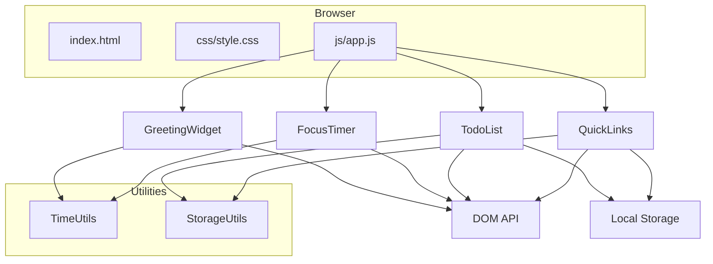
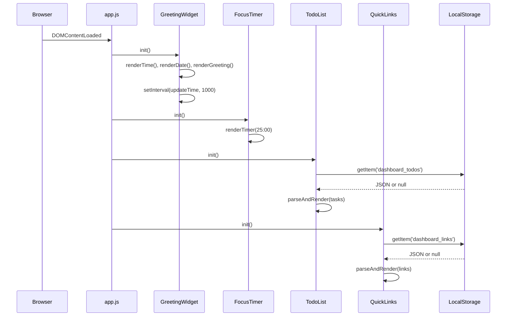

# Design Document: Personal Dashboard

## Overview

The Personal Dashboard is a standalone, single-page web application designed to replace the browser's default new tab page. It provides four productivity widgets: a time-based greeting, a focus timer (Pomodoro-style), a to-do list, and quick links to favorite websites.

The application is built entirely with vanilla HTML, CSS, and JavaScript — no frameworks, build tools, or backend dependencies. All user data is persisted in the browser's Local Storage API, making the dashboard fully self-contained and portable.

### Key Design Decisions

- **No framework**: Vanilla JS keeps the bundle at zero dependencies, ensures fast load times, and avoids version churn for a tool meant to be always-open.
- **Single HTML entry point**: Simplifies deployment as a local file, HTTP-served page, or browser extension new tab override.
- **Module pattern**: Each widget is encapsulated in its own JavaScript module (IIFE or ES module) to maintain separation of concerns without a bundler.
- **Local Storage for persistence**: Appropriate for small, user-local data (task lists, links) with no sync requirements.

## Architecture

The application follows a simple component-based architecture without a framework. Each widget is an independent module that manages its own state, DOM rendering, and Local Storage interaction.



### Initialization Flow



## Components and Interfaces

### 1. GreetingWidget

Responsible for displaying the current time (HH:MM, 24-hour), the full date, and a time-of-day greeting message.

**Public Interface:**
```javascript
GreetingWidget.init(containerElement)
// Renders time, date, greeting and starts the update interval

GreetingWidget.destroy()
// Clears intervals (for testing/cleanup)
```

**Internal Methods:**
- `getGreeting(hour: number): string` — Returns greeting text based on hour (0–23)
- `formatTime(date: Date): string` — Returns "HH:MM" string
- `formatDate(date: Date): string` — Returns "DayOfWeek, Month DayNumber" string
- `update()` — Called every second; updates time display, checks if greeting/date need refresh

### 2. FocusTimer

A 25-minute countdown timer with start, stop (pause), and reset controls.

**Public Interface:**
```javascript
FocusTimer.init(containerElement)
// Renders timer at 25:00 with control buttons

FocusTimer.destroy()
// Clears any active interval
```

**Internal Methods:**
- `start()` — Begins or resumes countdown; no-op if already running
- `stop()` — Pauses countdown, retains remaining time
- `reset()` — Stops countdown, resets to 25:00
- `tick()` — Decrements remaining seconds, updates display, triggers notification at 0
- `formatTimer(totalSeconds: number): string` — Returns "MM:SS" string
- `showNotification()` — Displays completion notification

**State:**
- `remainingSeconds: number` (0–1500)
- `timerState: 'stopped' | 'running' | 'paused'`
- `intervalId: number | null`

### 3. TodoList

Manages task creation, editing, completion toggling, and deletion with Local Storage persistence.

**Public Interface:**
```javascript
TodoList.init(containerElement)
// Loads tasks from storage, renders list and input form

TodoList.destroy()
// Cleanup (for testing)
```

**Internal Methods:**
- `addTask(text: string): boolean` — Validates and adds task; returns success
- `editTask(id: string, newText: string): boolean` — Validates and updates task text
- `toggleTask(id: string): void` — Toggles completion status
- `deleteTask(id: string): void` — Removes task from list
- `validateTaskText(text: string): { valid: boolean, error?: string }` — Checks non-empty, non-whitespace, ≤200 chars
- `saveTasks(): void` — Persists current task list to Local Storage
- `loadTasks(): Task[]` — Reads and parses tasks from Local Storage
- `render(): void` — Re-renders the full task list DOM

### 4. QuickLinks

Manages user-configured link buttons with Local Storage persistence.

**Public Interface:**
```javascript
QuickLinks.init(containerElement)
// Loads links from storage, renders link buttons and add form

QuickLinks.destroy()
// Cleanup (for testing)
```

**Internal Methods:**
- `addLink(label: string, url: string): boolean` — Validates and adds link
- `deleteLink(id: string): void` — Removes link
- `validateLink(label: string, url: string): { valid: boolean, error?: string }` — Checks label non-empty (≤50 chars), URL starts with http:// or https://, max 20 links
- `saveLinks(): void` — Persists current link list to Local Storage
- `loadLinks(): Link[]` — Reads and parses links from Local Storage
- `render(): void` — Re-renders link buttons

### 5. StorageUtils (Shared Utility)

Provides safe Local Storage read/write with error handling.

**Public Interface:**
```javascript
StorageUtils.save(key: string, data: any): { success: boolean, error?: string }
// JSON.stringify and setItem with quota/availability error handling

StorageUtils.load(key: string, validator: Function): { data: any, valid: boolean }
// getItem, JSON.parse, and validation; returns null data if invalid

StorageUtils.isAvailable(): boolean
// Feature-detection for Local Storage
```

### 6. TimeUtils (Shared Utility)

Pure functions for time formatting and greeting logic.

**Public Interface:**
```javascript
TimeUtils.getGreeting(hour: number): string
// Returns greeting string for hour 0-23

TimeUtils.formatTime(date: Date): string
// Returns "HH:MM" (24-hour, zero-padded)

TimeUtils.formatDate(date: Date): string
// Returns "DayOfWeek, Month DayNumber"

TimeUtils.formatTimer(totalSeconds: number): string
// Returns "MM:SS" (zero-padded)
```

## Data Models

### Task

```javascript
{
  id: string,          // Unique identifier (e.g., UUID or timestamp-based)
  text: string,        // Task description (1-200 characters, trimmed)
  completed: boolean,  // Completion status
  createdAt: number    // Timestamp for ordering
}
```

**Local Storage Key:** `dashboard_todos`
**Storage Format:** JSON array of Task objects, ordered by `createdAt` ascending.

### Link

```javascript
{
  id: string,          // Unique identifier
  label: string,       // Display label (1-50 characters, trimmed)
  url: string,         // URL starting with "http://" or "https://"
  createdAt: number    // Timestamp for ordering
}
```

**Local Storage Key:** `dashboard_links`
**Storage Format:** JSON array of Link objects, ordered by `createdAt` ascending.

### Validation Rules Summary

| Field | Rule |
|-------|------|
| Task.text | Non-empty after trim, ≤200 characters |
| Link.label | Non-empty after trim, ≤50 characters |
| Link.url | Must start with `http://` or `https://` |
| Links count | Maximum 20 links |

## Correctness Properties

*A property is a characteristic or behavior that should hold true across all valid executions of a system — essentially, a formal statement about what the system should do. Properties serve as the bridge between human-readable specifications and machine-verifiable correctness guarantees.*

### Property 1: Time formatting produces valid HH:MM

*For any* valid Date object, `formatTime(date)` shall produce a string matching the pattern `HH:MM` where HH is the zero-padded hour (00–23) and MM is the zero-padded minute (00–59), and the values correspond to the Date's hours and minutes.

**Validates: Requirements 1.1**

### Property 2: Date formatting produces correct full date string

*For any* valid Date object, `formatDate(date)` shall produce a string in the format "DayOfWeek, Month DayNumber" where DayOfWeek is the full English day name, Month is the full English month name, and DayNumber is the numeric day of the month (without leading zero), all matching the Date's actual values.

**Validates: Requirements 1.2**

### Property 3: Greeting maps hours to correct time periods

*For any* integer hour in the range 0–23, `getGreeting(hour)` shall return "Good Morning" for hours 5–11, "Good Afternoon" for hours 12–17, "Good Evening" for hours 18–21, and "Good Night" for hours 22–23 and 0–4.

**Validates: Requirements 2.1, 2.2, 2.3, 2.4**

### Property 4: Timer formatting produces valid MM:SS

*For any* integer `totalSeconds` in the range 0–1500, `formatTimer(totalSeconds)` shall produce a string matching the pattern `MM:SS` where MM is the zero-padded minutes (00–25) and SS is the zero-padded seconds (00–59), and `MM * 60 + SS` equals the original `totalSeconds`.

**Validates: Requirements 3.1**

### Property 5: Timer stop preserves remaining time

*For any* running timer with remaining seconds in the range 1–1500, calling stop shall transition the timer to the paused state with the same remaining seconds value unchanged.

**Validates: Requirements 3.5**

### Property 6: Timer reset always produces initial state

*For any* timer state (running, paused, or stopped) with any remaining seconds value, calling reset shall set remaining seconds to 1500 and transition to the stopped state.

**Validates: Requirements 3.6**

### Property 7: Timer start while running is idempotent

*For any* running timer with remaining seconds in the range 1–1500, calling start shall leave both the timer state as running and the remaining seconds unchanged.

**Validates: Requirements 3.7**

### Property 8: Valid task addition grows list by one

*For any* existing task list and any valid task text (non-empty after trim, at most 200 characters), adding the task shall increase the list length by exactly one, and the last task in the list shall have the submitted text (trimmed) with completed status false.

**Validates: Requirements 4.1**

### Property 9: Task edit preserves identity and updates text

*For any* existing task in a list and any valid new text (non-empty after trim, at most 200 characters), editing the task shall update only its text field to the new value (trimmed) while preserving its id, completed status, and position in the list.

**Validates: Requirements 4.2**

### Property 10: Task toggle is a round-trip

*For any* task, toggling its completion status twice shall return the task to its original completion state.

**Validates: Requirements 4.3, 4.4**

### Property 11: Task deletion removes exactly the target task

*For any* task list containing at least one task, deleting a task by its id shall reduce the list length by exactly one, the deleted task's id shall not appear in the resulting list, and all other tasks shall remain in their original order with unchanged data.

**Validates: Requirements 4.5**

### Property 12: Whitespace-only text is always rejected

*For any* string composed entirely of whitespace characters (spaces, tabs, newlines, or empty string), `validateTaskText` shall return invalid, and attempting to add or edit a task with such text shall leave the task list unchanged.

**Validates: Requirements 4.6, 4.7**

### Property 13: Task list persistence round-trip

*For any* valid task list (array of tasks with valid text, boolean completed, and string ids), serializing to Local Storage and then deserializing shall produce a task list equal to the original, preserving each task's text, completed status, id, and list order.

**Validates: Requirements 5.1, 5.2**

### Property 14: Corrupted task data recovery

*For any* string that is not a valid JSON array of task objects (including malformed JSON, arrays with missing fields, or wrong types), loading tasks from storage shall return an empty list and save the empty list back to storage.

**Validates: Requirements 5.4**

### Property 15: Valid link addition succeeds

*For any* valid label (non-empty after trim, at most 50 characters) and valid URL (starting with "http://" or "https://"), when the current link count is below 20, adding the link shall increase the link list length by one and the new link shall have the provided label and URL.

**Validates: Requirements 6.1**

### Property 16: Link deletion removes exactly the target link

*For any* link list containing at least one link, deleting a link by its id shall reduce the list length by exactly one, the deleted link's id shall not appear in the resulting list, and all other links shall remain in their original order with unchanged data.

**Validates: Requirements 6.3**

### Property 17: Invalid link input is always rejected

*For any* input where the label is blank/whitespace-only, or the URL is blank, or the URL does not start with "http://" or "https://", attempting to add a link shall leave the link list unchanged and return an error.

**Validates: Requirements 6.4**

### Property 18: Link list persistence round-trip

*For any* valid link list (array of links with valid labels, valid URLs, and string ids), serializing to Local Storage and then deserializing shall produce a link list equal to the original, preserving each link's label, URL, id, and list order.

**Validates: Requirements 7.1, 7.2**

### Property 19: Corrupted link data recovery

*For any* string that is not a valid JSON array of link objects (including malformed JSON, arrays with missing fields, or wrong types), loading links from storage shall return an empty list and save the empty list back to storage.

**Validates: Requirements 7.4**

## Error Handling

### Local Storage Errors

| Scenario | Handling |
|----------|----------|
| `localStorage` unavailable (private browsing, disabled) | `StorageUtils.isAvailable()` returns false; widgets operate in memory-only mode; a non-blocking warning banner is shown |
| Quota exceeded on write | `StorageUtils.save()` returns `{ success: false, error: 'quota_exceeded' }`; widget displays inline error message; in-memory state remains valid |
| Corrupted/unparseable data on read | `StorageUtils.load()` returns `{ data: null, valid: false }`; widget initializes with empty state and overwrites corrupted data |
| JSON.parse throws on malformed data | Caught inside `StorageUtils.load()`; treated as corrupted data |

### Input Validation Errors

| Scenario | Handling |
|----------|----------|
| Empty/whitespace task text | `validateTaskText` returns `{ valid: false, error: 'empty' }`; form shows inline error; list unchanged |
| Task text exceeds 200 characters | `validateTaskText` returns `{ valid: false, error: 'too_long' }`; form shows inline error with character count |
| Empty/whitespace link label | `validateLink` returns `{ valid: false, error: 'label_empty' }`; form shows inline error |
| Link label exceeds 50 characters | `validateLink` returns `{ valid: false, error: 'label_too_long' }`; form shows inline error |
| URL missing http/https protocol | `validateLink` returns `{ valid: false, error: 'invalid_url' }`; form shows inline error |
| Maximum 20 links reached | `validateLink` returns `{ valid: false, error: 'max_links' }`; form shows inline error |

### Timer Edge Cases

| Scenario | Handling |
|----------|----------|
| Start pressed while already running | No-op; state unchanged (idempotent) |
| Stop pressed while already stopped | No-op; state unchanged |
| Timer reaches 0 | Interval cleared; notification displayed; state set to 'stopped' with 0 remaining |
| Browser tab becomes inactive | Timer uses `setInterval`; may drift when tab is backgrounded. On tab focus, remaining time is recalculated based on elapsed wall-clock time |

### Browser Compatibility

| Scenario | Handling |
|----------|----------|
| Required API missing (e.g., `localStorage`, `Date`) | Feature detection at startup; unsupported browser message displayed |
| CSS features unsupported | Progressive enhancement; layout degrades gracefully to single-column |

## Testing Strategy

### Unit Tests (Example-Based)

Unit tests cover specific scenarios, edge cases, and integration points:

- **GreetingWidget**: Init renders time/date/greeting; midnight boundary updates date; interval updates time
- **FocusTimer**: Start from stopped/paused; countdown reaches zero shows notification; stop then resume preserves time
- **TodoList**: Add task renders in DOM with correct styling; mark done applies strikethrough; empty storage shows empty list; quota exceeded shows error
- **QuickLinks**: Click opens URL in new tab; 20-link limit shows error; empty storage shows empty list
- **Browser compatibility**: Missing API shows unsupported message

### Property-Based Tests

Property-based tests verify universal correctness properties using the **fast-check** library (JavaScript PBT library). Each property test runs a minimum of 100 iterations with randomly generated inputs.

**Configuration:**
- Library: [fast-check](https://github.com/dubzzz/fast-check)
- Minimum iterations: 100 per property
- Test runner: Any standard runner (e.g., Vitest, Jest)

**Properties to implement:**

| Property | Tag | Target Function |
|----------|-----|-----------------|
| 1: Time formatting | Feature: personal-dashboard, Property 1: Time formatting produces valid HH:MM | `TimeUtils.formatTime` |
| 2: Date formatting | Feature: personal-dashboard, Property 2: Date formatting produces correct full date string | `TimeUtils.formatDate` |
| 3: Greeting mapping | Feature: personal-dashboard, Property 3: Greeting maps hours to correct time periods | `TimeUtils.getGreeting` |
| 4: Timer formatting | Feature: personal-dashboard, Property 4: Timer formatting produces valid MM:SS | `TimeUtils.formatTimer` |
| 5: Stop preserves time | Feature: personal-dashboard, Property 5: Timer stop preserves remaining time | `FocusTimer.stop` |
| 6: Reset produces initial | Feature: personal-dashboard, Property 6: Timer reset always produces initial state | `FocusTimer.reset` |
| 7: Start is idempotent | Feature: personal-dashboard, Property 7: Timer start while running is idempotent | `FocusTimer.start` |
| 8: Task addition | Feature: personal-dashboard, Property 8: Valid task addition grows list by one | `TodoList.addTask` |
| 9: Task edit | Feature: personal-dashboard, Property 9: Task edit preserves identity and updates text | `TodoList.editTask` |
| 10: Toggle round-trip | Feature: personal-dashboard, Property 10: Task toggle is a round-trip | `TodoList.toggleTask` |
| 11: Task deletion | Feature: personal-dashboard, Property 11: Task deletion removes exactly the target task | `TodoList.deleteTask` |
| 12: Whitespace rejection | Feature: personal-dashboard, Property 12: Whitespace-only text is always rejected | `TodoList.validateTaskText` |
| 13: Task persistence | Feature: personal-dashboard, Property 13: Task list persistence round-trip | `StorageUtils.save/load` |
| 14: Corrupted task recovery | Feature: personal-dashboard, Property 14: Corrupted task data recovery | `TodoList.loadTasks` |
| 15: Link addition | Feature: personal-dashboard, Property 15: Valid link addition succeeds | `QuickLinks.addLink` |
| 16: Link deletion | Feature: personal-dashboard, Property 16: Link deletion removes exactly the target link | `QuickLinks.deleteLink` |
| 17: Invalid link rejection | Feature: personal-dashboard, Property 17: Invalid link input is always rejected | `QuickLinks.validateLink` |
| 18: Link persistence | Feature: personal-dashboard, Property 18: Link list persistence round-trip | `StorageUtils.save/load` |
| 19: Corrupted link recovery | Feature: personal-dashboard, Property 19: Corrupted link data recovery | `QuickLinks.loadLinks` |

### Integration / Manual Tests

- Cross-browser testing (Chrome, Firefox, Edge, Safari — latest 2 versions)
- Responsive layout at 320px, 600px, 1024px, 1920px viewports
- File:// protocol vs HTTP vs browser extension new tab mode
- Performance: DOMContentLoaded to full render < 1 second
- Timer accuracy: drift measurement over 25-minute session
- Color contrast verification (WCAG 4.5:1 ratio)

